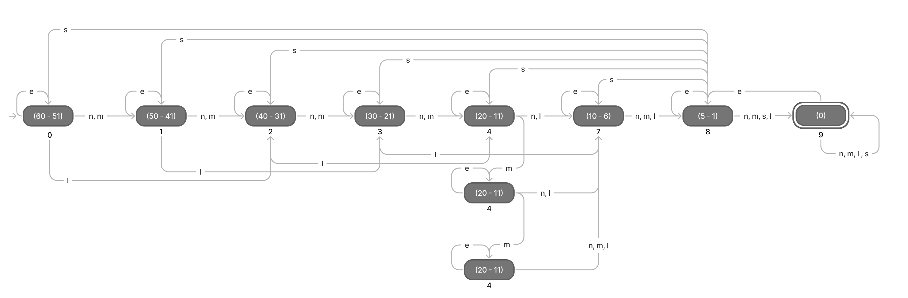

# Traffic State Machine
This application of Finite State Machine models a simple traffic flow of a single lane. This machine will
control the time of the traffic light in the given lane. 

The traffic light in this scenario will adapt to the situation of the traffic. As such, it abides by the 
following rules:

1. Traffic light countdown starts at 60 seconds. 
2. The final 5 seconds serves as safety allowance. All force stops leads to here. No skipping and/or going back 
on time shall be done at this point except when the lane detects an emergency within the lane. 
3. T-0 is the final state. No input can make the count skip or go back except when the lane detects an 
emergency within the lane.
4. The traffic light checks the flow of the current traffic. It counts the volume of cars and checks for 
out certain emergencies. On every ten seconds and at the final 5 seconds, it acts upon its assessment.
5. If the amount of cars in the lane are reducing at an anticipated rate, the countdown proceeds as normal.
6. If the amount of cars in the lane are reducing slower than anticipated, it means there are more cars in 
the lane than anticipated. Hence, the countdown goes back ten seconds. For efficiency, it only goes back
right before t-minus 10 seconds.
7. If the amount of cars in the lane are reducing faster than anticipated, it means there are now lesser
cars in the lane than anticipated. Hence, the countdown goes forward ten seconds. For safety, it should not
go forward from t-minus 10 to 0.
8. The countdown can only go back or move forward twice. 
9. If an emergency vehicle is detected within the lane, it loops the countdown within the current segment 
of ten (or 5) seconds until the emergency vehicle has passed.
10. If another lane needs to use the intersection, the lane will prepare to stop to give way for the other lane.

## States
There are ten (10) states in this system. Each state typically represent a range of 10 seconds from 60 
down to 0. There are exceptions; the last 10 seconds are split into the `10-5`, `5-1`, and `0`. The `5-1`
is for final countdown and give time for the motorists to brake. The `0` is there to indicate the end of 
the green light.

| Time Segment     | Code | Purpose                                             |
|------------------|------|-----------------------------------------------------|
| 60 - 51 secs     | 0    |                                                     |
| 50 - 41 secs     | 1    |                                                     |
| 40 - 31 secs     | 2    |                                                     |
| 30 - 21 secs     | 3    |                                                     |
| 20 - 11 secs (a) | 4    |                                                     |
| 20 - 11 secs (b) | 5    | This is the 1st time extension.                     |
| 20 - 11 secs (c) | 6    | This is the 2nd time extension.                     |
| 10 - 6 secs      | 7    |                                                     |
| 5 - 1 secs       | 8    | Buffer time to give time for the motorist to brake. |
| 0 sec            | 9    | Indicates the end of the green light.               |

## Inputs
The inputs depend on the traffic situation. There are five of them in this system:
1. Neutral (n) - Indicates a normal flow of traffic.
2. Emergency (e) - Indicates that an emergency vehicle is coming through the lane.
3. More Cars (m) - Indicates a greater or increased volume of cars than expected. 
4. Less Cars (l) - Indicates a lesser or decreased volume of cars than expected. 
5. Force Stop (s) - Indicates that the lane is forcibly closed to give way to another lane, especially for emergencies.

In the real world, sensors and certain algorithms will be used to truly check the state of traffic
However, in this system, it is simulated using random values. Each input is also given probability 
rates to more closely mimic the real life.

## Transition Table
The states normally take `neutral` inputs. However, the time maybe extended or decreased depending on the 
car count. Note that the time may only be extended or shortened at most *twice*. Moreover, emergency 
situations may also change the states. For `emergency`, the time will loop again in its current state. For 
`force stop`, the flow must end immediately to give way to another lane needing access.

|   | neutral (0) | emergency (1) | more cars (2) | less cars (3) | force stop (4) |
|---|-------------|---------------|---------------|---------------|----------------|
| 0 | 1           | 0             | 1             | 2             | 8              |
| 1 | 2           | 1             | 2             | 3             | 8              |
| 2 | 3           | 2             | 3             | 4             | 8              |
| 3 | 4           | 3             | 4             | 7             | 8              |
| 4 | 7           | 4             | 5             | 7             | 8              |
| 5 | 7           | 5             | 6             | 7             | 8              |
| 6 | 7           | 6             | 7             | 7             | 8              |
| 7 | 8           | 7             | 8             | 8             | 8              |
| 8 | 9           | 8             | 9             | 9             | 9              |
| 9 | 9           | 8             | 9             | 9             | 9              |

## State Machine Diagram

